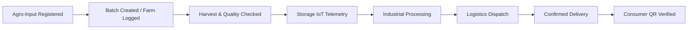

# AgroChain: Blockchain-Powered Smart Cassava and Maize Value Chain Ecosystem

<p align="center">
	
</p>

<p align="center">
	<strong>A secure digital ecosystem for cassava and maize value chains.</strong><br />
	Enabling end-to-end batch traceability, agro-input authenticity, IoT storage monitoring, processing provenance, logistics tracking, B2B marketplace coordination, and verifiable consumer QR verification.
</p>

<p align="center">
	
	
	
	
	
	
	
</p>

---

## Table of Contents

- [Ecosystem Overview](#ecosystem-overview)
- [System Architecture](#system-architecture)
- [Permissioned Stakeholder Roles](#permissioned-stakeholder-roles)
- [Dual-Crop Value Chain Workflows](#dual-crop-value-chain-workflows)
- [Security, OSINT & Anti-Backdoor Protections](#security-osint--anti-backdoor-protections)
- [Demonstrator Simulation Disclosures](#demonstrator-simulation-disclosures)
- [Prerequisites](#prerequisites)
- [Quick Start Guide](#quick-start-guide)
- [API Specification](#api-specification)
- [Automated Testing](#automated-testing)
- [Live Demo Walkthrough](#live-demo-walkthrough)
- [License](#license)

---

## Ecosystem Overview

AgroChain transforms agricultural supply chains by unifying on-chain smart contracts with empirical data analytics and role-aware operational dashboards:

1. **Dual-Crop Value Chains**: First-class support for both **Cassava** (roots, HQCF, starch, garri) and **Maize** (grain, flour, grits, feed).
2. **Permissioned Digital Identity**: 11 cryptographic stakeholder roles managed by on-chain access controls.
3. **8-Stage Provenance**: Forward-only immutable audit trail from certified agro-inputs to consumer verification.
4. **Agro-Input Authenticity**: Registration and regulatory certification of seeds and fertilizers linked directly to harvest batches.
5. **Storage & IoT Telemetry**: Continuous monitoring of storage facility temperature and humidity with threshold breach alerts.
6. **Processing & Quality Certification**: Detailed outputs, moisture levels, and official safety assessments (e.g. Aflatoxin/Cyanide safety).
7. **B2B Agricultural Marketplace**: Direct listings, procurement orders, and verifiable order state management.
8. **Demonstrable Settlement & Insurance**: Transparent simulated payment intents and crop insurance claims records.
9. **Public QR Consumer Verification**: Instant provenance lookup accessible to any consumer without requiring a wallet or administrative account.
10. **AI-Ready Deterministic Risk Engine**: Reproducible risk scoring based on storage temperature breaches, transit delays, and physiological decay models.
11. **Observable Cybersecurity Telemetry**: Audit logging for authentication, authorization rejections, invalid state attempts, and incident remediation.

---

## System Architecture

| Layer | Responsibility | Technology |
| :--- | :--- | :--- |
| **Smart Contract** | Immutable batch state machine, custody transfers, role access control, and event emission | Solidity `^0.8.20`, Hardhat |
| **Blockchain Network** | Local permissioned EVM execution ledger | Ganache Local (Chain ID `1337`) |
| **Data Pipeline** | Automated sourcing & normalization of empirical Cassava & Maize production data | Node.js (`scripts/dataset-pipeline.mjs`) |
| **API & Telemetry Server** | IoT observation ingestion/simulation, deterministic risk scoring, and security incident management | Node.js HTTP Server (`server/dataset-api.mjs`) |
| **Web Frontend** | 9 role-aware navigation views, wallet connection, responsive UI | React 18, Vite 5, Tailwind CSS, thirdweb v5 |

---

## Permissioned Stakeholder Roles

AgroChain enforces strict role-based access control (RBAC) across 11 defined stakeholder types:

| Role ID | Role Name | Allowed Operations |
| :--- | :--- | :--- |
| `1` | **ADMINISTRATOR** | Deployer authority, stakeholder registration, status management, system sync. |
| `2` | **FARMER** | Create crop batches, record farm activities, link inputs, create marketplace listings. |
| `3` | **INPUT_SUPPLIER** | Register certified seeds, cuttings, and organic fertilizers. |
| `4` | **EXTENSION_OFFICER** | Agronomic verification, input inspections, and field quality assessments. |
| `5` | **STORAGE_OPERATOR** | Log facility observations, record IoT temperature and humidity readings. |
| `6` | **PROCESSOR** | Record industrial milling/transformation (HQCF, starch, grits), list processed goods. |
| `7` | **TRANSPORTER** | Accept dispatch, update transit progress, confirm delivery. |
| `8` | **DISTRIBUTOR** | Bulk procurement, warehouse distribution, custody acceptance. |
| `9` | **FINANCIAL_INSTITUTION** | Issue crop insurance policies, process indemnity claims, oversee settlement records. |
| `10` | **REGULATOR** | Certify inputs, issue official food safety certificates (Moisture, Aflatoxin compliance). |
| `11` | **CONSUMER** | Public provenance lookup and QR scan verification. |

---

## Dual-Crop Value Chain Workflows



Lifecycle stages advance strictly forward:
`CREATED` → `INPUT_VERIFIED` → `FARM_RECORDED` → `HARVESTED` → `STORED` → `PROCESSED` → `IN_TRANSIT` → `DELIVERED` → `CONSUMER_VERIFIED`.

---

## Security, OSINT & Anti-Backdoor Protections

- **Zero Backdoors**: No hidden owner bypasses, arbitrary fund drain functions, or administrative loopholes exist in the smart contracts.
- **OSINT Safeguards**: Sensitive stakeholder wallet addresses are sanitized and masked in public audit logs (`0x1a89...4b92`) to prevent intelligence harvesting.
- **Authoritative Validation**: Security permissions are strictly validated on-chain in smart contracts and server-side, not merely in the client UI.
- **No Third-Party Fund Custody**: Demonstrator payments and insurance records do not hold user custody funds, eliminating drain attack vectors.
- **Strict Boundary Telemetry**: Telemetry observes only real application events (authentications, failed authorizations, invalid state transitions, rate limit alerts). No unverified network-wide intrusion detection is claimed.

---

## Demonstrator Simulation Disclosures

In accordance with academic and product evaluation standards, all local simulated workflows are explicitly labeled:

1. **Storage & IoT Telemetry**: Labeled as **"Simulated IoT Telemetry"**. Local simulation endpoints mimic environmental sensors.
2. **Digital Payments**: Labeled as **"Simulated Payment Settlement (Demo Mode)"**. Operates in `SIM-NGN` demo units.
3. **Agricultural Insurance**: Labeled as **"Simulated Insurance Coverage (Demonstration)"**. Underwriting and claim settlements are managed on-chain without external financial banking integrations.
4. **AI Risk Scoring**: Labeled as **"AI-Ready Risk Insights (Deterministic Evaluation Prototype)"**. Employs reproducible deterministic environmental and latency heuristics rather than a black-box model.

---

## Prerequisites

- **Node.js**: `v18.0.0` or later
- **Ganache**: Running locally on `http://127.0.0.1:7545` with Chain ID `1337`
- **MetaMask**: Installed in browser with Ganache custom network added

---

## Quick Start Guide

### 1. Start Ganache
Ensure your local Ganache instance is running on:
- RPC URL: `http://127.0.0.1:7545`
- Chain ID: `1337`

### 2. Compile & Deploy AgroChain Contract
```powershell
# Compile smart contracts
npm run compile

# Deploy to local Ganache network
$env:GANACHE_PRIVATE_KEY="0xYOUR_GANACHE_ACCOUNT_KEY"
npm run deploy
```
*Deployment automatically synchronizes `ui/src/contract-address.json` and `ui/src/abi.json`.*

### 3. Build Dual-Crop Dataset
```powershell
npm run dataset:build
```
*Sources and normalizes Our World in Data Cassava and Maize production statistics with reliable fallbacks.*

### 4. Start Local Data & Telemetry API
```powershell
npm run api:dataset
```
*Listens on port `3030` (with auto-fallback to `3031+` and automatic `ui/.env` synchronization).*

### 5. Launch AgroChain Web Application
```powershell
cd ui
npm run dev
```
Open `http://localhost:5173` in your browser.

---

## API Specification

| Endpoint | Method | Description |
| :--- | :--- | :--- |
| `/health` | `GET` | Service status and health discovery. |
| `/api/dataset/summary` | `GET` | Summary metrics for Cassava and Maize value chains. |
| `/api/dataset/records` | `GET` | Query records with `?crop=cassava` or `?crop=maize`, `?region=...`, `?limit=20`. |
| `/api/dataset/challenges` | `GET` | Empirical supply-chain challenge analysis. |
| `/api/iot/readings` | `GET` | Timestamped storage temperature & humidity telemetry. |
| `/api/iot/reading` | `POST` | Ingest IoT sensor reading with threshold breach detection. |
| `/api/iot/simulate` | `POST` | Trigger demonstrator simulated IoT reading for a batch. |
| `/api/analytics/risk-insights` | `GET` | Compute deterministic risk score (`?batchId=...&crop=...`). |
| `/api/security/events` | `GET/POST` | Audit log for observable application security events. |
| `/api/security/incidents` | `GET` | Tracked security incidents with severity and audit status. |
| `/api/security/incidents/:id/action` | `POST` | Acknowledge, investigate, or resolve security incident. |

---

## Automated Testing

AgroChain includes full-suite automated tests across contract logic, local API telemetry, and UI workflows:

```powershell
# Run Hardhat smart contract tests (11 roles, dual crops, security checks)
npm test

# Run Local API and telemetry tests
npm run test:api

# Run End-to-end setup and Ganache smoke test
npm run setup:test

# Run Playwright UI workflow and mobile accessibility tests
cd ui
npx playwright test
```

---

## Live Demo Walkthrough

Refer to [docs/LIVE_DEMO_SCRIPT.md](file:///c:/Users/akint/Documents/Coding/bb2/docs/LIVE_DEMO_SCRIPT.md) for a comprehensive step-by-step presentation script covering:
1. Connecting Administrator, Farmer, and Processor accounts.
2. Logging Cassava and Maize batches with crop selection and origin clusters.
3. Registering and linking certified seeds.
4. Simulating warehouse IoT temperature readings and threshold breach alerts.
5. Recording milling transformation and regulatory quality certification.
6. Dispatching shipments and confirming delivery.
7. Marketplace procurement and simulated payment settlement.
8. Public QR consumer verification without wallet authentication.
9. Security incident investigation and remediation.

---

## License

Developed for academic evaluation and agricultural supply chain demonstration.
